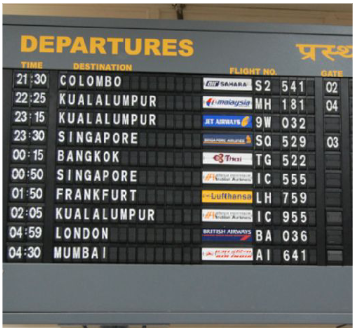
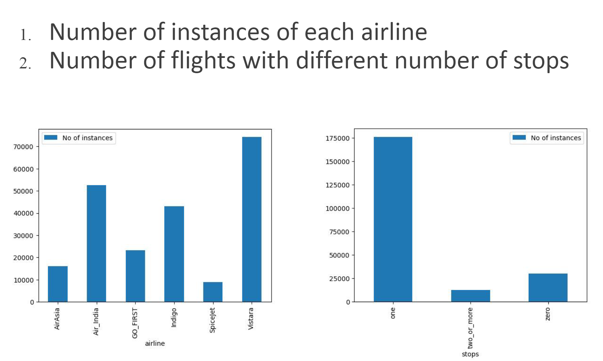
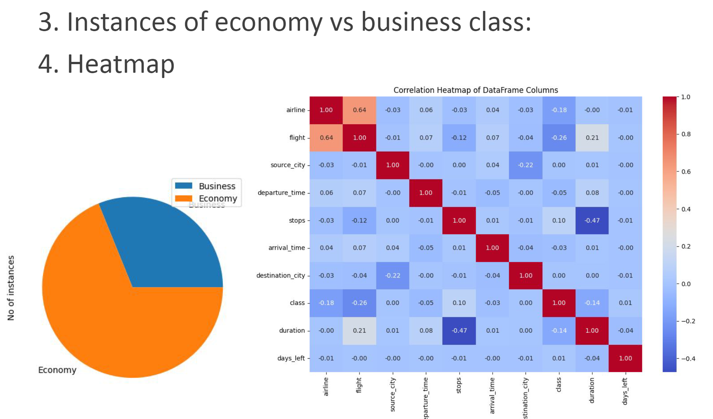
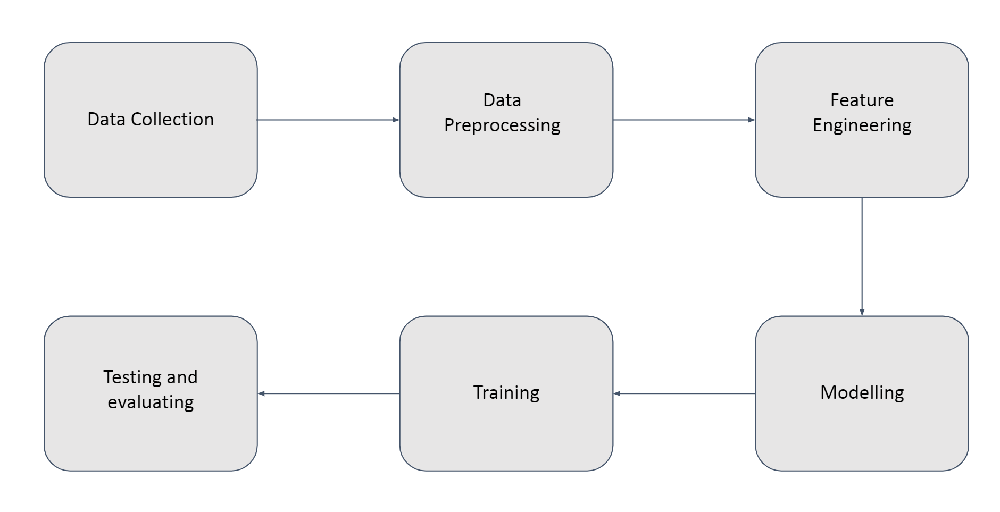

# Flight Price Prediction

## Project Overview
This project, undertaken by Group 3 for our ML course, aims to predict flight prices using machine learning techniques. We developed a model that helps travelers make informed decisions by forecasting flight costs based on various factors.

## Table of Contents
1. [Motivation](#motivation)
2. [Literature Review](#literature-review)
3. [Dataset Description](#dataset-description)
4. [Methodology](#methodology)
5. [Results and Analysis](#results-and-analysis)
6. [Timeline](#timeline)
7. [Contribution](#contribution)

## Motivation
Flight prices vary significantly due to multiple factors such as airlines, destinations, and departure schedules. This variability makes it challenging for travelers to make cost-effective decisions. Our project seeks to leverage machine learning to build a model that accurately predicts flight prices, helping users optimize their travel plans and reduce costs.

## Literature Review
### Research Paper 1
[Flight Price Prediction](https://www.ijraset.com/research-paper/flight-price-prediction) (IJRASET, 2022)

This paper discusses a project by students of Guru Nanak Institute of Technology that uses Decision Trees, Random Forests, and XGBoosts for predicting flight prices. They achieved the best results with Decision Trees, showing 78% accuracy.

### Research Paper 2
[A Framework for Airfare Price Prediction: A Machine Learning Approach](https://www.researchgate.net/publication/335936877_A_Framework_for_Airfare_Price_Prediction_A_Machine_Learning_Approach)

This paper presents a comprehensive approach to airfare price prediction using machine learning.

## Dataset Description
The dataset includes features such as:

| Feature            | Description                                           |
|--------------------|-------------------------------------------------------|
| Airline            | Name of the airline                                   |
| Flight             | Flight number                                         |
| Source_City        | Departure city                                        |
| Departure_Time     | Time of departure                                     |
| Stops              | Number of stops                                       |
| Arrival_Time       | Time of arrival                                       |
| Destination_City   | Destination city                                      |
| Class              | Seat class (economy/business)                         |
| Duration           | Total flight duration                                 |
| Days_left          | Days left for the flight                              |
| Price              | Flight price                                          |

## Methodology
1. **Data Collection**
2. **Data Preprocessing**
   - Handling missing values
   - Encoding categorical features
   - Normalizing numerical features
   - Bootstrapping to balance the dataset
3. **Feature Engineering**
4. **Modeling**
   - Training and testing various models
5. **Evaluation**

## Results and Analysis
We evaluated multiple models:

| Model                  | Results |
|------------------------|---------|
| Linear Regression      | [Results Image](Image/Linear.png) |
| Lasso Regularization   | [Results Image](Image/Lasso.png) |
| Ridge Regularization   | [Results Image](Image/Ridge.png) |
| SGD Regressor          | [Results Image](Image/SGD.png) |
| Naive Bayes            | [Results Image](Image/Naive_Bayes.png) |
| SVM                    | [Results Image](Image/SVM.png) |
| Decision Tree          | [Results Image](Image/Decision_tree.png) |
| Random Forest          | [Results Image](Image/Random_Forest.png) |
| Polynomial Regression  | [Results Image](Image/Polynomial.png) |

### Final Results
Our study found that **Polynomial Regression**, **Naive Bayes**, **Random Forest**, and **Decision Trees** were the top-performing models. Among these, **Random Forest** provided the highest accuracy. 

To ensure the robustness of our results, we performed K-fold Cross Validation on each model, confirming that Random Forest consistently delivered superior performance.
